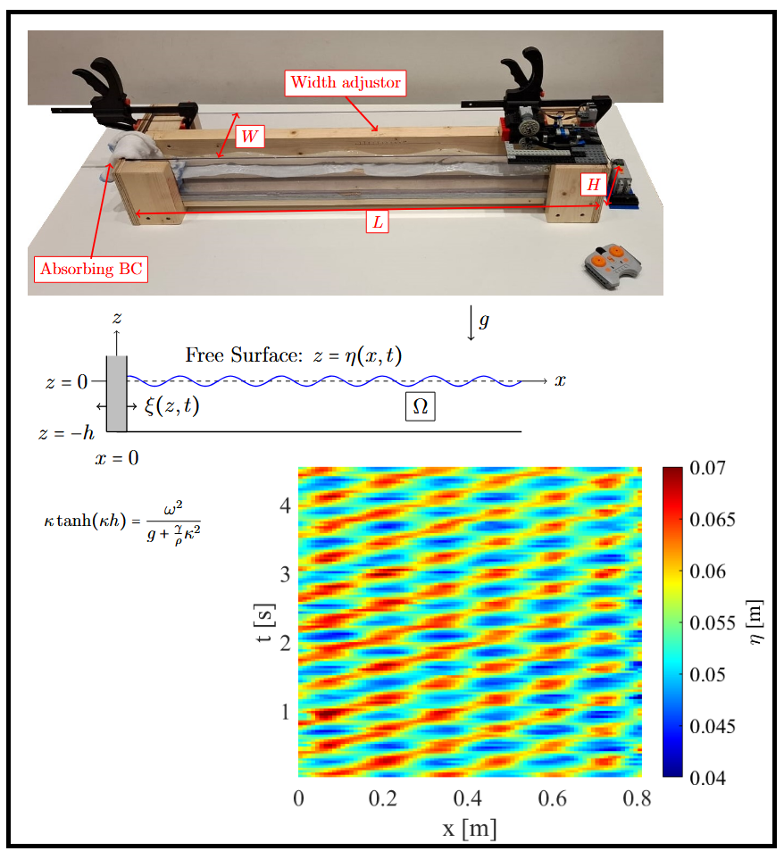

# waveFlume

Suite of data analysis codes for a teaching-and-learning project studying waves in a flume.  The USP of the project is the very nice use of **Lego** to create a piston wavemaker.  

* Documentation to accompany the project: [abs/2507.18403](https://arxiv.org/abs/2507.18403).
* The flume and the wavemaker are described in a **YouTube video** (clickable link below).

# Project overview:

* The flume is made from wood and Perspex and the wavemaker is made from Lego.
* Data from the wavemaker was captured using a mobile phone and uploaded to YouTube.
* The frames from the video have been extracted and digitized.
* The free surface from each frame has been stored in a csv file available in this repository.
* The data has been postprocessed to extract the waveform.
* Postprocessing routines (using matlab) are available here.
* The results are consistent with classical linear water-wave theory in the small-amplitude approximation.

# Repository Structure:

* Sample OpenFOAM / OlaFlow test case: in SAMPLE/
* Data from video analysis of the wave maker: in data/
* Lego instructions for how to build the wave maker in lego/
* Matlab nonlinear least squares code to fit a travelling wave to the data: model1/
* Matlab nonlinear least squares code to fit a superposition of a standing wave and a travelling wave to the data: model2/
* Python code to compute the amplitudes of all the modes in the linear theory for the piston wavemaker.

# Citation

waveFlume has a DOI that can be included in citations: 

