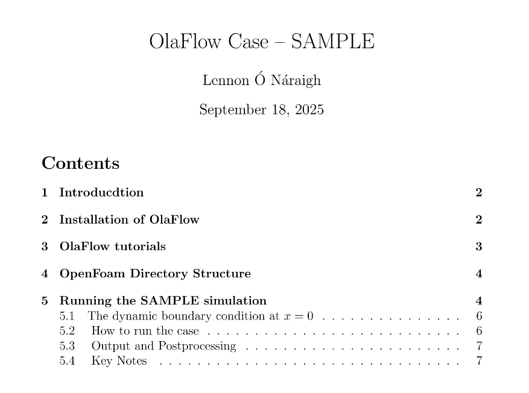

# waveFlume/SAMPLE

Sample OlaFlow case -- SAMPLE.  Requires:

* installation of OpenFoam
* installation of OlaFlow

Detailed instructions on how to install OlaFlow and run the case SAMPLE are included in the pdf openFOAM\_readme.pdf (or click on the image below).

